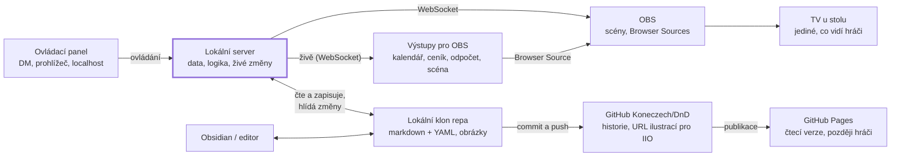

# DM Hub — zadání

> **Toto je master zadání.** Platí tento soubor v repu. Claude Doc „DM Hub — zadání“ je od 2. 10. 2026 jen archiv.
> Změny zadání se dělají v tomto souboru přes pull request, aby byly vidět v historii.

Stav k 2. 10. 2026 · autor: Matěj (DM)

## Účel a kontext

DM Hub je lokální ovládací panel pro DM, který pod jedno okno spojí nástroje kampaně a ovládá vše, co hráči vidí přes OBS. Hráči Hub nevidí, jejich jediným výstupem je TV u stolu.

Kampaň: D&D 5e (pravidla 2024, SRD 5.2.1), severní Mečové pobřeží, 1491 DR, čtyři hráči u fyzického stolu.

**Výchozí stav k 2. 10. 2026 — nástroje žijí odděleně a data na pěti místech:**

| Oblast | Co existuje | Kde žijí data dnes |
| --- | --- | --- |
| Kalendář Harptos | `kalendar.html` (editor, malý medailon, velký orloj), datový motor Harptos s testy v Node.js, události veřejné/skryté a vícedenní, lhůty k událostem | `kalendar-data.js` jen v lokálním klonu, v `.gitignore` kvůli skrytým událostem |
| Obchody | `polozky.json` (231 položek), `generator.html`, `cenik.html` | lokální klon, na GitHubu nejsou |
| OBS | `odpocet.html`, scény na numpadu, pozadí lokací, carousel iniciativy | lokální klon, na GitHubu nejsou |
| Souboje | Improved Initiative (Epic), vlastní CSS carousel, statbloky v JSON, 330 bytostí v knihovně | IIO; vlastní ilustrace 9 bytostí v `monsters/` na GitHubu |
| Ilustrace | ChatGPT 1536×1024 → Affinity 1920×1080, `prompty.md`, `pripravit_ilustraci.py` | GitHub bez jednotné konvence: portréty postav v kořeni repa, NPC Torva a Malk Orren v `monsters/`, scéna v `Places/Mirabar/` |
| Kánon | Lazy RPG Campaign Planner: Campaign Database, Characters, Registr rozhodnutí, Hrací kánon, zápisy sezení | Notion |
| Postavy | Dotazník k postavě (odpovědi hráčů), karty postav, překladový klíč | Google formulář (xlsx), Claude projekt |

Problém: stejná entita existuje v několika kopiích (Tusker v Notionu, v JSON pro IIO, jako ilustrace v kořeni repa, v dotazníku a v Claude projektu), soubory nemají jednotnou konvenci a u stolu se žongluje mezi samostatnými okny.

Verze 1 převede do repa kánon, kalendář, obchody, postavy a ilustrace míst. Duplicita se statbloky v IIO zůstane až do exportu ve verzi 2.

## Potvrzená rozhodnutí

Rozhodnutí 1–12 potvrdil DM 2. 10. 2026. Rozhodnutí 13–24 vzešla z první oponentury zadání, 25–32 z oponentury postupu výroby; DM je přijal týž den. Rozhodnutí 39–42 potvrdil DM 3. 10. 2026 (akceptace Bloku 1b a start Bloku 2). Rozhodnutí 33–38 potvrdil DM 2. 10. 2026 při kontrole ⚠ návrhů Bloku 0. Nepotvrzené návrhy jsou výslovně označené a shrnuté v Otevřených bodech.

| # | Rozhodnutí | Důsledek |
| --- | --- | --- |
| 1 | Kánon kampaně opouští Notion, žije jako markdown + YAML v Git repu | Hub, Claude i Obsidian čtou stejné soubory. Šablona Lazy RPG se replikuje složkami |
| 2 | Jedno veřejné repo `Koneczech/DnD`, nic se neskrývá | Příznak veřejné/skryté řídí jen zobrazení, ne zabezpečení. Platí i pro dotazníky hráčů |
| 3 | Lokální Hub u stolu + statická verze na GitHub Pages pro čtení | Lokální server je páteř; Pages je jen čtecí výstup |
| 4 | Hub je jen ovládací panel DM; hráči vidí vše přes OBS | Každý výstup pro hráče = Browser Source servírovaný Hubem |
| 5 | Verze 1 = živý panel pro sezení, verze 2 = příprava | Pořadí bloků 0, 1a, 1b, 2, 3, pak příprava |
| 6 | Improved Initiative zůstává trackerem i knihovnou nestvůr | Vlastní modul iniciativy se nedělá |
| 7 | Vlastní bytosti, NPC a postavy žijí v repu, Hub je exportuje do IIO | Export patří do verze 2 (příprava); import do IIO zůstává ruční |
| 8 | Hráčská stránka na GitHub Pages až ve výhledu | Datový model s ní počítá od začátku (příznak veřejné/skryté u všech entit). Čtecí verze pro DM i hráčská stránka jsou veřejné, hráčská stránka je filtr, ne ochrana |
| 9 | Odpočet slouží výhradně k začátku sezení | Žádné dílky ani časovač na rozhodování |
| 10 | Skryté/odkryté = celé ilustrace, ne vrstvy | Ilustrace se stopou k zápletce se ve slideshow nezobrazí, dokud ji DM neodkryje |
| 11 | Další den nic nesleduje, jen připomíná | Žádné sledování pozic kouzel, podob ani BV |
| 12 | Pocket Bard = inspirace přepínači (stavy, intenzita) | Hub nepřehrává zvuk ani hudbu |
| 13 | Tajné hodnoty (heslo OBS WebSocketu, případný API klíč) žijí jen v `hub/.env` mimo Git | Zadávají se v panelu na obrazovce Nastavení; v repu je jen vzor `hub/.env.example` |
| 14 | Entita = složka `<typ>/<id>/` s hlavním souborem `<id>.md` a vlastními obrázky | Jedna konvence pro všechny typy; funguje v Hubu, Obsidianu i na GitHubu |
| 15 | Vazby se zapisují jako odkazy Obsidianu `[[id]]` | Proklikávání a graf v Obsidianu i v Hubu bez převodu |
| 16 | Repo je jediný zdroj pravdy | Notion, Claude projekt a dotazník jsou po převodu jen archiv |
| 17 | Sezení má životní cyklus Zahájit / Ukončit | Hub zakládá soubor sezení, poznámky mají kam padat, uložení do GitHubu je jedno tlačítko |
| 18 | Existující soubory se přesouvají až s modulem, který je převezme, v jednom commitu se všemi odkazy | Blok 0 nic nepřesouvá; OBS ani IIO se přesunem nerozbijí |
| 19 | Data kalendáře se commitují do repa | Ruší `.gitignore` u `kalendar-data.js`; skryté události budou na GitHubu čitelné v souladu s rozhodnutím 2 |
| 20 | Samostatný kalendář se od začátku Bloku 1b dál nevyvíjí | Velký orloj a banner vznikají rovnou jako výstupy Hubu |
| 21 | Technologie: Node.js (LTS), panel i výstupy bez build kroku | Jeden jazyk pro server, panel i výstupy; převezme datový motor Harptos i s testy |
| 22 | Pojmy: Odpočet = začátek sezení, Lhůty = odpočty k událostem v kalendáři | Žádná záměna v panelu ani v kódu |
| 23 | Herní termíny podle českého PHB 2024 a `prekladovy-klic-cz.md` | Důkladný odpočinek, kostky obnovy, body výdrže (BV) |
| 24 | Ilustrace se v Hubu připravují poloautomaticky: prompt z entity → ChatGPT → import s automatickou úpravou | Blok 2 má ilustrační dílnu; přímé generování přes API je otevřený bod |
| 25 | Master zadání je `ZADANI.md` v repu | Claude Doc je archiv. Změny zadání jdou přes PR |
| 26 | Pravidla pro práci Claude Code jsou v `CLAUDE.md` v kořeni repa | Co zadání neřeší a má vliv na data, chování nebo UI, je v PR označené ⚠ návrh a přidané do Otevřených bodů. Interní detaily kódu rozhoduje Claude sám |
| 27 | Každý blok se vyvíjí ve vlastní větvi (`blok-0`, `blok-1a` …) a slučuje se přes pull request | PR je místo kontroly všech ⚠ návrhů |
| 28 | Testy běží v GitHub Actions na `ubuntu-latest` i `windows-latest` | Rozdíly Windows (zámky souborů, hlídání souborů, cesty) se odhalí před akceptací doma |
| 29 | Verze Node.js je na jednom místě: `.nvmrc`; `engines` v `hub/package.json` musí sedět | CI čte verzi z `.nvmrc` a při neshodě s `engines` selže |
| 30 | Konce řádků jsou v repu vždy LF (`.gitattributes`: `* text=auto eol=lf`) | Testy porovnávající obsah souborů se na Windows chovají stejně jako na Linuxu |
| 31 | Git hook je krátký shell skript, logika je v Node.js (`hub/hooks/pre-commit.js`) | Git na Windows spouští hooky přes svůj `sh`; logika se testuje na obou systémech |
| 32 | Lokální klon repa nesmí ležet v OneDrive | OneDrive soubory zamyká a hlídání souborů hlásí falešné změny. Hub to při startu ověří a upozorní |
| 33 | Název kampaně: „Limba: Rok kamenné borovice“ | Uložen v `kampan/kampan.yaml` |
| 34 | Výchozí port Hubu je 7420, jen localhost | Změna jde v Nastavení |
| 35 | Odložené zápisy přežijí pád serveru | Žurnál v `hub/.stav/odlozene-zapisy/` (mimo Git). Po startu se dokončí; novější soubor na disku má přednost a záznam se zahodí |
| 36 | Nastavení se ukládá tlačítkem Uložit nastavení | Výjimka z autosave: rozepsané heslo se neposílá po písmenech |
| 37 | Pilotní místo Bloku 2 je tábor lupičů kousek od Longsaddle | Celé příští sezení je bojové v tomto táboře |
| 38 | Počasí: déšť, sníh, mlha. Intenzita: tři úrovně | Rozsah efektů Bloku 2 |
| 39 | Pole `lhuta` u události kalendáře | Počet dní předem (1–999), kdy se událost ukazuje v OBS; starší pole `odpocet` z `kalendar-data.js` importér převede |
| 40 | Poznámky a sezení nesou datum v Harptosu | Poznámka `- 18:05 (19. Eleint) — text`; hlavička sezení `harptos_zacatek` a `harptos_konec` |
| 41 | Ilustrace míst a OBS pozadí patří do repa | Z `src/` se přesunou s Blokem 2; v repu jsou veřejné včetně skrytých ilustrací (rozhodnutí 2) |
| 42 | Ilustrace zatím vznikají ručně přes ChatGPT | Dílna připraví prompt a zpracuje obrázek; přímé generování přes API je cíl do budoucna (otevřený bod 1) |
| 43 | Obrazovka **U stolu** nahrazuje Scény OBS, Odpočet a Obchody | Dlaždice scén s ovládáním podle role scény: Start (odpočet), Místo, Obchod, Souboj. Místa zůstávají jako **Místa – správa** (příprava, ne živé ovládání) |
| 44 | Role scén v OBS jsou na jednom místě | Tabulka Role scén dole na U stolu: Start, Místo, Obchod, Souboj a „po doběhnutí odpočtu“. Zmizela tři roztroušená nastavení (Odpočet, Obchody, Místa) i dvě v Nastavení |

## Architektura

Jádrem je malý lokální server v Node.js na DM PC: čte a zapisuje soubory v lokálním klonu repa, hlídá jejich změny, servíruje ovládací panel a výstupy pro OBS a posílá změny do OBS živě.



Improved Initiative do schématu nevstupuje: jeho carousel je v OBS samostatná scéna a ilustrace čte z GitHubu jako dnes.

| Komponenta | Role | Poznámka |
| --- | --- | --- |
| Lokální server | Datová vrstva, logika modulů, živé posílání změn | Node.js, jeden proces, pevný port v `hub/.env` |
| Ovládací panel | Jediné rozhraní DM, běží v prohlížeči na localhost | Globální lišta: stav kampaně, Zahájit/Ukončit sezení, Další den, Poznámka (F2), Hledat |
| Výstupy pro OBS | Jedna stránka na modul (kalendář, ceník, odpočet, scéna), v OBS jako Browser Source | Umístění a velikost řeší OBS, ne HTML; při výpadku serveru drží poslední stav |
| Živá synchronizace | Server posílá změny výstupům a panelu přes WebSocket (`/api/zive`); každý výstup odebírá jen svoje události. Původně SSE, viz otevřený bod 45 | Výstupy se po výpadku samy znovu připojí |
| Hlídání souborů | Změna souboru z Obsidianu nebo editoru se promítne do panelu i výstupů | Soubor na disku má vždy přednost |
| OBS WebSocket | Přepínání scén z panelu | Vestavěné v OBS 28+; numpad funguje dál paralelně |
| Ilustrační dílna | Prompt z entity, import a úprava obrázku do složky entity | Blok 2; zpracování obrázků lokálně |
| Konfigurace `hub/.env` | Heslo OBS, port, PIN, případný API klíč | Mimo Git; vyplňuje se v panelu |
| Git | Kontrola a stažení změn při startu, commit a push při Ukončit sezení | Git nainstalovaný na PC s přihlášením k GitHubu |
| Lokální klon repa | Jediný zdroj dat i obrázků | Browser Source čte obrázky přes lokální server, odpadá omezení OBS Image source na vzdálené URL. Mimo OneDrive |
| GitHub Koneczech/DnD | Historie změn, zdroj URL ilustrací pro IIO | Veřejné repo |
| GitHub Pages | Statická čtecí verze, později hráčská stránka | Generuje se z repa (Blok 3) |

## Provoz a odolnost u stolu

Hub musí přežít vlastní pád uprostřed sezení bez zásahu do OBS a bez ztráty dat. Prostředí: Windows 11, OBS i Hub na stejném PC, nainstalovaný Git a Node.js.

**Spuštění.** Zástupce DM Hub na ploše spustí server a otevře panel. Spouštěč hlídá proces a po pádu ho do 5 s spustí znovu.

**Tajné hodnoty**

- Heslo OBS WebSocketu, port, PIN a případný API klíč žijí jen v `hub/.env`. Soubor je v `.gitignore`, v repu je vzor `hub/.env.example` bez hodnot.
- Když `.env` chybí, panel otevře obrazovku Nastavení. DM vloží heslo z OBS (Tools → WebSocket Server Settings) a Hub ho uloží. Soubor se ručně needituje; změna jde kdykoli udělat v Nastavení.
- Panel heslo zobrazuje jen zamaskované a server ho neposílá do prohlížeče ani do výstupů.
- Pojistky: Hub při prvním spuštění nainstaluje Git hook, který odmítne commit souboru `.env` i řetězců podobných klíčům. Na GitHubu se v nastavení repa zapne Secret Protection a Push protection (secret scanning). Na heslo OBS Push protection nezabere, protože nemá rozpoznatelný formát; hlavní pojistkou je hook.

**Výpadek serveru**

- Výstupní stránka drží poslední zobrazený stav a sama se znovu připojí. Hráči výpadek nepoznají.
- Browser Sources v OBS mají vypnuté Shutdown source when not visible i Refresh browser when scene becomes active, aby stránka zůstala načtená i bez serveru. Hub to ověří a v panelu upozorní.
- Zápis souborů je atomický (dočasný soubor + přejmenování), pád nikdy nenechá rozbitý soubor.
- **Zamčený soubor.** Na Windows přejmenování přes existující soubor selže (`EPERM`/`EBUSY`/`EACCES`), pokud ho má otevřený Obsidian, antivir nebo indexer. Zápis to zkusí nejvýš 5× v celkovém limitu 1 s. Když nepomůže ani to, změna zůstane v paměti serveru jako odložený zápis, panel ukáže varování a zápis se opakuje na pozadí, dokud neprojde. Data se neztratí a nikdy se nesáhne po neatomickém zápisu.
- Panel ukazuje stav serveru, OBS a Gitu.
- Scény a IIO fungují bez Hubu. Nouzový postup, dokud Hub neprojde Blokem 1b u stolu: scény přepínat klikem přímo v OBS (numpad DM nepoužívá, ⚠ bod 29), kalendář, ceník a odpočet spustit z původních souborů v lokálním klonu.

**Ukládání a Git**

- Každá změna v panelu se automaticky zapíše do souboru (autosave) a zároveň okamžitě odešle do výstupů. Tlačítko Uložit neexistuje.
- Hlídání souborů: změnu z Obsidianu nebo editoru Hub načte do 1 s. Soubor na disku má vždy přednost před stavem v panelu.
- Při startu Hub zjistí, jestli je na GitHubu novější stav (úpravy z Obsidianu nebo GitHubu mimo domov), a nabídne Stáhnout změny. Zahájit sezení s nestaženými změnami jde jen po potvrzení.
- Ukončit sezení nabídne Uložit do GitHubu: commit se zprávou „Sezení NN — datum“ a push. Uložit jde i kdykoli ručně z panelu.

**Přístup z jiných zařízení.** Server ve výchozím stavu naslouchá jen na localhost. Ovládání z notebooku nebo tabletu v domácí síti jde zapnout v Nastavení a chrání ho PIN z `hub/.env`.

## Výroba a ověřování

- Každý blok vzniká ve vlastní větvi a slučuje se přes pull request. Popis PR obsahuje všechny ⚠ návrhy, které blok udělal mimo zadání.
- GitHub Actions spouští testy na `ubuntu-latest` i `windows-latest` při každém pushi a PR. Verzi Node.js čte z `.nvmrc` (`actions/setup-node`, `node-version-file`) a jeden krok ověří, že `engines` v `hub/package.json` ukazuje na stejnou verzi.
- Test zámku souboru na Windows zamyká soubor procesem bez sdílení (PowerShell `[System.IO.File]::Open($path, 'Open', 'ReadWrite', 'None')`). Zámek z Node.js se nepoužívá, protože Node otevírá soubory se sdíleným režimem, který přejmenování povoluje, a test by tak prošel i tam, kde skutečný zámek zápis rozbije.
- `windows-latest` je Windows Server bez Obsidianu a OBS. Skutečný test s Obsidianem, OBS a numpadem patří do akceptace doma.

**Příprava domácího PC (jednou, před akceptací Bloku 0)**

- [ ] Lokální klon repa leží mimo OneDrive (ne v Dokumentech ani na Ploše, pokud je synchronizuje). Pokud tam leží, přesunout ho dřív, než se z něj spustí Hub.
- [ ] Node.js ve verzi z `.nvmrc`
- [ ] Git s přihlášením k GitHubu (Git Credential Manager nebo GitHub Desktop); bez něj nefunguje Stáhnout změny ani Uložit do GitHubu
- [ ] OBS 28 nebo novější, Tools → WebSocket Server Settings: zapnutý server a nastavené heslo
- [ ] Zjistit, co v lokálním klonu skutečně je (`odpocet.html`, `cenik.html`, `generator.html`, `polozky.json`, `kalendar.html`, `pripravit_ilustraci.py`, testy datového motoru Harptos) a commitnout to beze změny umístění (bez `kalendar-data.js`, ten přijde s importérem v 1b). Chybějící testy zapsat do Otevřených bodů

## Datový model

Repo je jediný zdroj pravdy a data v něm mají tři tvary s jednou konvencí. Každá pozdější změna formátu jde přes verzi schématu a migrační skript, ne ruční přepisování.

| Tvar | Kdy | Podoba | Příklad |
| --- | --- | --- | --- |
| Entita | Věc s vlastními obrázky nebo vazbami | Složka `<typ>/<id>/` s hlavním souborem `<id>.md` a obrázky | `npc/torva/torva.md` + `portret.png` |
| Záznam | Čistě textová položka bez obrázků | Jeden soubor `<typ>/<id>.md` | `rozhodnuti/kruh-bez-jmena.md` |
| Kolekce | Mnoho malých položek stejného druhu | Jeden soubor se seznamem | `kalendar/udalosti.yaml`, `obchody/polozky.json` |

**Pravidla**

- Hlavní soubor entity nese stejné jméno jako složka, takže odkaz `[[torva]]` v Obsidianu najde jednoznačný cíl.
- `id` = slug: malá písmena bez diakritiky, slova oddělená pomlčkou (`krkavci-prapor`). Je unikátní napříč celou kampaní, i mezi typy.
- Cesta k obrázku v hlavičce je relativní ke složce entity (`portret.png`). Cesta začínající `/` vede od kořene repa (`/monsters/torva.png`) a slouží jen pro soubory, které se zatím nepřesunuly.
- Obrázky se jmenují `<záběr>-<varianta>[-<stav>].png`, například `celek-den.png` nebo `celek-noc-po-pozaru.png`. Ilustrační dílna je pojmenuje sama.
- Vazby v hlavičce i odkazy v textu se píšou jako `[[id]]`. Hub i Obsidian je čtou stejně.
- Pole `aliases` a `tags` zůstávají anglicky, protože je Obsidian rozpoznává jako aliasy a štítky.
- Každá hlavička nese `schema: 1`. Změnu formátu provede skript v `hub/migrace/`, který Hub spustí při startu a výsledek ukáže v panelu.
- Hub data při startu i při každé změně ověří (chybějící nebo duplicitní `id`, neexistující obrázek nebo vazba) a problémy ukáže v přehledu Kontrola dat. Rozbitý soubor nezastaví zbytek.

**Struktura repa**

```
Koneczech/DnD/
├─ README.md                  co kde je, jak spustit Hub
├─ ZADANI.md                  master zadání
├─ CLAUDE.md                  pravidla pro Claude Code
├─ .gitignore                 hub/.env, node_modules/, dočasné soubory
├─ .gitattributes             konce řádků LF
├─ .nvmrc                     verze Node.js
├─ .github/workflows/         CI na Ubuntu a Windows
├─ hub/                       kód aplikace
│  ├─ server/  panel/  vystupy/  migrace/  hooks/  test/
│  ├─ nastroje/               převzaté samostatné nástroje (generator.html)
│  ├─ .env.example
│  └─ package.json
├─ kampan/                    data kampaně
│  ├─ kampan.yaml             název, startovní datum, verze schématu
│  ├─ stav.md                 aktuální datum, místo, číslo a stav sezení
│  ├─ pripominky.yaml         kolekce pro Další den
│  ├─ postavy/<id>/           hráčské postavy, odpovědi z dotazníku v těle
│  ├─ npc/<id>/
│  ├─ padouchove/<id>/
│  ├─ frakce/<id>/            kruh, Krkavčí prapor, rody
│  ├─ mista/<id>/             místa + scény pro slideshow
│  ├─ predmety/<id>/
│  ├─ bytosti/<id>/           vlastní nestvůry: statblok + ilustrace
│  ├─ sezeni/s01/             s01.md: zápis a poznámky ze stolu; později přepis a statistiky
│  ├─ rozhodnuti/<id>.md      registr rozhodnutí DM
│  ├─ kanon/<id>.md           hráčský kánon
│  ├─ kalendar/udalosti.yaml
│  └─ obchody/
│     ├─ polozky.json         formát beze změny
│     └─ sortimenty/<id>.yaml
├─ sablony/                   šablony entit a přípravy Lazy DM (Obsidian i Hub)
├─ reference/                 prekladovy-klic-cz.md, prompty.md
├─ archiv/                    zdrojové exporty (Notion, dotazník) a vyřazené nástroje
└─ monsters/                  zmrazeno kvůli URL v IIO, nic nového sem nepřibývá
```

Nový typ entity (například `lode/` nebo `bohove/`) znamená novou složku a jednu hodnotu v seznamu typů. Kód Hubu ani existující soubory se nemění.

**Společná hlavička**

| Pole | Povinné | Význam |
| --- | --- | --- |
| `schema` | ano | Verze formátu, nyní 1 |
| `id` | ano | Slug shodný se jménem složky nebo souboru |
| `typ` | ano | postava, npc, padouch, frakce, misto, predmet, bytost, sezeni, rozhodnuti, kanon |
| `nazev` | ano | Zobrazované jméno s diakritikou |
| `verejne` | ano | `true` = smí do OBS a na hráčskou stránku |
| `aliases` | ne | Další jména pro hledání |
| `vazby` | ne | Seznam `[[id]]` |
| `tags` | ne | Volné štítky |
| `ilustrace` | ne | Seznam obrázků (viz místo níže) |
| `zdroj` | ne | Odkaz na původní kartu v Notionu nebo jiný zdroj |

Příklad entity (`kampan/npc/torva/torva.md`):

```yaml
---
schema: 1
id: torva
typ: npc
nazev: Torva
verejne: true
vazby: ["[[lurkwood]]"]
ilustrace:
  - soubor: /monsters/torva.png   # do npc/torva/ se přesune s exportem do IIO ve verzi 2
    ucel: portret
zdroj: <odkaz na kartu v Notionu>
---
Volný text: popis, poznámky DM, statblok pro verzi 2. Odkaz v textu: [[lurkwood]].
```

Místo s ilustracemi pro slideshow (`kampan/mista/<id>/<id>.md`, hlavička):

```yaml
ilustrace:
  - soubor: celek-den.png
    ucel: scena          # scena | portret | token | karta
    varianta: den
    stav: vychozi
    skryta: false
    prompt: "..."        # prompt, ze kterého obrázek vznikl (doplní dílna)
  - soubor: celek-noc.png
    ucel: scena
    varianta: noc
    stav: vychozi
    skryta: false
  - soubor: detail-stopa.png
    ucel: scena
    skryta: true         # stopa k zápletce, DM odkryje u stolu
```

**Připomínky pro Další den** (`kampan/pripominky.yaml`), potvrzený obsah:

| Kdy | Kdo | Připomínka |
| --- | --- | --- |
| Po důkladném odpočinku | Všichni | Doplnit BV, všechny kostky obnovy a pozice kouzel. Snížit vyčerpání o 1 |
| Po důkladném odpočinku | Tusker | Obnovit všechna použití Zuřivosti a Návalu adrenalinu (Adrenaline Rush) a Neúnavnou výdrž (Relentless Endurance). Může vyměnit jedno mistrovství zbraně |
| Po důkladném odpočinku | Koudur | Obnovit Bardskou inspiraci a použití Kamenného vnímání (Stonecunning) |
| Po důkladném odpočinku | Alba | Může změnit připravená kouzla. Obnovit Divoké podoby, Léčivé ruce (Healing Hands) a Nebeské zjevení (Celestial Revelation). Může vyměnit jednu známou podobu |
| Po důkladném odpočinku | Leta | Může vyměnit jedno mistrovství zbraně |
| Vždy | DM | Dnešní události a svátky, lhůty, přepnout scénu na ráno |
| Bez důkladného odpočinku | Všichni | Upozornění: zdroje obnovované důkladným odpočinkem se neobnovují |

Seznam upravuje DM přímo v souboru (v Obsidianu nebo editoru), například při postupu na vyšší úroveň. Názvy schopností druhů v překladovém klíči chybí, proto je u nich anglický originál (otevřený bod 4).

## Migrace existujících dat

Každý existující zdroj má cíl v repu a blok, ve kterém se přesune. Pravidlo pro každý přesun: jeden commit přesune soubor a opraví všechny odkazy (OBS, IIO, HTML, hlavičky entit) a OBS i IIO se hned poté ověří.

| Zdroj dnes | Cíl v repu | Kdy | Poznámka |
| --- | --- | --- | --- |
| `prekladovy-klic-cz.md`, `prompty.md` (Claude projekt) | `reference/` | Blok 0 | Nové soubory, nic se nerozbije |
| `odpocet.html` | výstup Hubu; originál do `archiv/nastroje/` | Blok 1a | Originál zůstane v lokálním klonu, dokud Hub neprojde jedním sezením |
| `kalendar-data.js` (mimo Git) | `kampan/kalendar/udalosti.yaml` | Blok 1b | Importér v Hubu s kontrolou počtu událostí; originál zůstane jako záloha |
| `kalendar.html` | výstupy Hubu; originál do `archiv/nastroje/` | Blok 1b | Datový motor a testy se převezmou do `hub/` |
| `polozky.json` | `kampan/obchody/polozky.json` | Blok 1b | Formát beze změny |
| `generator.html` | `hub/nastroje/generator_sablona.html`, Hub ho servíruje na `/nastroje/generator.html` s daty z `kampan/obchody/polozky.json` | Blok 1b | Doplní se Uložit sortiment; plné převzetí do panelu ve verzi 2. `Apps/Shop/generator.html` zůstává jako záloha |
| `cenik.html` | výstup Hubu; originál do `archiv/nastroje/` | Blok 1b | Originál zůstane, dokud Hub neprojde dvěma sezeními |
| `Places/Mirabar/fight.png` | `kampan/mista/mirabar/ulicka-noc.png` | Blok 2 (hotovo) | OBS ho od té doby čte přes Hub |
| `pripravit_ilustraci.py` | `hub/nastroje/` | Blok 2 | Ilustrační dílna převezme ořez a zvětšení scén |
| Notion: Campaign Database (NPC, Location, Villain, Item) | `npc/`, `mista/`, `padouchove/`, `predmety/`, `frakce/` | Blok 3 | Postup v Bloku 3 |
| Notion: Campaign Database, tag Current | `stav.md` | Blok 3 | |
| Notion: Characters + Claude projekt `postavy/*.md` + dotazník (xlsx) | `postavy/<id>/<id>.md` | Blok 3 | Sloučí se do jednoho souboru na postavu; dotazník celý, xlsx do `archiv/` |
| Notion: Session Notes, Old Session Notes, Sezení 1, Session Zero Notes | `sezeni/s00/` (session zero), `sezeni/sNN/` | Blok 3 | |
| Notion: Registr rozhodnutí | `rozhodnuti/` | Blok 3 | |
| Notion: Hrací kánon | `kanon/` | Blok 3 | |
| Notion: Single-Page Lazy DM Prep Template | `sablony/priprava-lazy-dm.md` | Blok 3 | Do verze 2 se podle ní připravuje v Obsidianu |
| Notion: Forge of Foes, Dice Roller | odkazy v panelu | Blok 3 | |
| Portréty `Alba.png`, `Koudur.png`, `Leta.png`, `Tusker.png` v kořeni | `postavy/<id>/portret.png` | Verze 2 | Do té doby odkaz `/Alba.png`; přesun spolu s exportem do IIO |
| `monsters/torva.png`, `monsters/malk-orren.png` | `npc/<id>/portret.png` | Verze 2 | Totéž |
| Ostatní `monsters/` | `bytosti/<id>/` | Verze 2 | Totéž; do té doby zmrazeno |

Po převodu Claude projekt soubory postav nedrží; Claude čte repo. Verze 1 duplicitu se statbloky v IIO neodstraní.

## Blok 0 — Základ

Výsledek: prázdný ovládací panel, který běží lokálně, čte data z repa, umí se spojit s OBS a přežije vlastní pád. Bez tohoto bloku nejde postavit nic dalšího.

Obsah

- Složky `kampan/`, `hub/`, `sablony/`, `reference/`, `archiv/` podle Datového modelu, `README.md`, `.gitignore`, `.gitattributes`, `.nvmrc`, `CLAUDE.md`. Žádný existující soubor se nepřesouvá
- Lokální server: čtení a atomický zápis markdown + YAML (s opakováním a odloženým zápisem při zámku), ověření dat, hlídání souborů
- Spouštěč DM Hub na ploše s automatickým restartem
- `hub/.env`, obrazovka Nastavení a Git hook proti commitu tajných hodnot (shell wrapper + logika v Node.js)
- `kampan.yaml` a `stav.md` a jejich zobrazení v panelu
- Kostra panelu: navigace mezi moduly, globální lišta (stav kampaně, Zahájit/Ukončit sezení, Další den, Poznámka, Hledat) jako zatím neaktivní prvky, přehled Kontrola dat
- Spojení s OBS přes WebSocket, indikátor stavu serveru, OBS a Gitu
- Živé posílání změn do výstupů přes SSE s automatickým znovupřipojením
- Kontrola Gitu při startu a tlačítko Stáhnout změny
- Kontrola, že klon neleží v OneDrive
- `prekladovy-klic-cz.md` a `prompty.md` v `reference/`
- GitHub Actions: testy na `ubuntu-latest` a `windows-latest`, kontrola shody `.nvmrc` a `engines`

Akceptační kritéria

- Dvojklik na zástupce spustí Hub a do 10 s otevře panel v prohlížeči
- Panel ukazuje datum, místo a číslo sezení ze `stav.md`; změna v panelu se do 1 s zapíše do souboru bez tlačítka Uložit
- Úprava `stav.md` v Obsidianu se do 1 s projeví v panelu i v testovacím výstupu
- Bez `hub/.env` se otevře Nastavení; po zadání hesla se Hub připojí k OBS. `git status` soubor `.env` nikdy neukáže a hook odmítne commit testovacího klíče
- Panel ukazuje, zda je OBS připojené, a přepne libovolnou scénu do 500 ms
- Testovací výstup v OBS reaguje na změnu v panelu do 1 s, bez obnovování
- Po ukončení serveru ve Správci úloh zůstane výstup v OBS beze změny; Hub se do 5 s sám spustí a výstup se znovu připojí bez zásahu v OBS
- Soubor s chybnou hlavičkou se objeví v Kontrole dat a zbytek Hubu běží dál
- CI na `ubuntu-latest` i `windows-latest` je zelené. Na Windows test zamkne cílový soubor PowerShellem bez sdílení a ověří obojí: krátký zámek (uvolněný do 1 s) zápis přečká opakováním; dlouhý zámek skončí odloženým zápisem s varováním, soubor zůstane nepoškozený s původním obsahem a po uvolnění zámku se zápis dokončí
- Test hlídání souborů na `windows-latest` zachytí změnu souboru do 1 s
- Při otevřeném `stav.md` v Obsidianu doma změna z panelu projde nebo skončí varováním odloženého zápisu, nikdy rozbitým souborem
- CI selže, když `.nvmrc` a `engines` neukazují na stejnou verzi
- Všechny existující soubory v repu i v lokálním klonu zůstanou na svém místě a OBS i IIO fungují jako dřív

## Blok 1a — Řízení sezení

Výsledek: panel řídí sezení od odpočtu po uložení do GitHubu. Blok obsahuje nejjednodušší moduly, aby šel vyzkoušet u stolu co nejdřív; kalendář zatím běží samostatně.

| Modul | Co v panelu dělá | Převzaté požadavky |
| --- | --- | --- |
| Zahájit sezení | Zvýší číslo sezení ve `stav.md`, založí `sezeni/sNN/sNN.md` ze šablony (reálné datum, přítomní), připraví Odpočet | Bez aktivního sezení jdou poznámky do `sezeni/priprava.md` |
| Odpočet | Nastavení času začátku sezení, spuštění, pauza | Barevný přechod z `odpocet.html`; slouží jen k začátku sezení |
| Scény OBS | Tlačítka všech scén | Numpad funguje dál paralelně |
| Souboj | Jedno tlačítko přepne OBS na scénu s carouselem IIO | IIO a jeho CSS beze změny |
| Poznámka | Okno odkudkoli v panelu, klávesa F2 (mimo numpad, prohlížeč ji nepoužívá) | Zapíše se do souboru aktuálního sezení s reálným časem |
| Ukončit sezení | Zapíše konec, ukáže kontrolní seznam a nabídne Uložit do GitHubu | Commit „Sezení NN — datum“ a push |

Akceptační kritéria

- Zahájit sezení založí soubor se správným číslem a připraví Odpočet; Ukončit sezení zapíše konec a po potvrzení provede commit a push
- Odpočet jde nastavit a spustit z panelu a v OBS mění barvu jako `odpocet.html`
- Každá scéna OBS i Souboj jdou přepnout jedním klikem do 500 ms
- Poznámka jde otevřít klávesou F2 z kterékoli obrazovky a skončí v souboru aktuálního sezení
- Generální zkouška: 30 minut simulovaného sezení (zahájení, scény, souboj, poznámky, ukončení) bez jediné ruční akce v OBS kromě numpadu

## Blok 1b — Kalendář, Další den a obchody

Výsledek: kalendář a ceník běží z Hubu nad daty v repu a Další den spojí kalendář s připomínkami. Samostatný kalendář se od začátku bloku dál nevyvíjí (rozhodnutí 20).

| Modul | Co v panelu dělá | Převzaté požadavky |
| --- | --- | --- |
| Migrace kalendáře | Importér přečte `kalendar-data.js` a zapíše `kampan/kalendar/udalosti.yaml` | Počet i obsah událostí se musí shodovat; originál zůstane |
| Kalendář | Posun data, přidání a úprava události přes formulář, lhůty, výběr zobrazení (malý medailon, velký orloj, banner) | Datový motor Harptos i testy převzít z `kalendar.html`; vícedenní události; skryté události se v OBS nezobrazují; lhůty vlevo od malého orloje; velký orloj a banner dokončit rovnou jako výstupy Hubu |
| Další den | Viz níže | Nic nesleduje, jen připomíná |
| Ceník | Výběr uloženého sortimentu a odeslání do OBS | Umístění a velikost řeší OBS; písmo se přizpůsobí výšce zdroje, minimum 22 px |
| Generátor obchodů | Hub servíruje `generator.html` beze změny vzhledu a přidá Uložit sortiment do `kampan/obchody/sortimenty/` | Plné převzetí do panelu ve verzi 2 |

Další den — průběh

1. Kalendář posune datum o den a ukáže dnešní události, svátky a lhůty.
2. Panel se zeptá: „Proběhl důkladný odpočinek?“
3. Zobrazí seznam z `pripominky.yaml` podle odpovědi.
4. Do souboru aktuálního sezení zapíše „Nový den: <datum>“.

Od tohoto bloku nesou Poznámka, Zahájit i Ukončit sezení také datum v Harptosu.

Akceptační kritéria

- Importér vypíše počet událostí v `kalendar-data.js` a v `udalosti.yaml`; čísla se shodují a DM porovná oba seznamy vedle sebe
- Testy datového motoru Harptos (svátky, Shieldmeet v přestupném roce, přelom roku, vícedenní události) projdou v Hubu se stejnými výsledky
- Změna data nebo události se projeví v OBS do 1 s
- Sortiment uložený v generátoru se objeví v panelu a ceník ho v OBS ukáže bez ruční práce v OBS
- Další den projde kroky 1–4 a ukáže správný seznam pro obě odpovědi
- `kalendar.html`, `kalendar-data.js` a `cenik.html` zůstanou v lokálním klonu jako záloha, dokud Hub neprojde dvěma skutečnými sezeními; pak se přesunou do `archiv/nastroje/`

## Blok 2 — Scény a ilustrační dílna

Výsledek: místo se na TV ovládá jako prostředí se stavy a přepínači a jeho ilustrace vznikají v Hubu z dat místa. Inspirace: přepínače a intenzita z Pocket Bardu.

Scéna je jedna výstupní stránka v OBS (Browser Source). Obrázek i efekty se vykreslují v ní, přepnutí v panelu se v OBS plynule prolne.

| Přepínač | Co dělá | Příprava obrázků |
| --- | --- | --- |
| Slideshow místa | Záběry místa (celek, detail, interiér), další a předchozí s prolnutím | Víc obrázků k jednomu místu |
| Den / noc | Přepne na variantu ilustrace | Noční verze úpravou denní v ChatGPT, dílna k tomu připraví předlohu a prompt |
| Skryté / odkryté | Skrytá ilustrace se ve slideshow nezobrazí, dokud ji DM neodkryje | Příznak `skryta` v hlavičce místa |
| Stav místa | Přepnutí mezi stavy (např. před a po) | Varianta ilustrace se stavem |
| Počasí | Animovaná vrstva přes obrázek (déšť, sníh, mlha) | Bez nových obrázků |
| Intenzita | Úrovně nálady: tónování, vinětace, ztmavení | Bez nových obrázků |

**Ilustrační dílna**

Dílna zkrátí cestu od nápadu k obrázku v OBS na tři kroky v panelu a u scén odstraní ruční práci v Affinity.

1. **Prompt.** DM vybere místo (nebo NPC), záběr a variantu. Hub sestaví prompt ze stylu v `reference/prompty.md`, popisu entity, záběru, varianty, stavu a počasí. Prompt jde upravit a jedním klikem zkopírovat; tlačítko otevře ChatGPT.
2. **Import.** DM přetáhne vygenerovaný obrázek do dílny. Hub ho ořízne z 1536×1024 na 16:9 (1536×864, výřez jde posunout), zvětší na 1920×1080, uloží do složky entity podle konvence pojmenování a zapíše do hlavičky i s použitým promptem. Nová ilustrace je vždy skrytá.
3. **Schválení.** Náhled vedle ostatních ilustrací místa; DM ji odkryje, nastaví variantu a stav, nebo zahodí.

Pro noční nebo jinou variantu dílna nabídne existující obrázek jako předlohu ke vložení do ChatGPT a prompt, který zachová kompozici. Portréty (1080×1500, odstranění pozadí) zůstávají v `pripravit_ilustraci.py` a dílna je převezme ve verzi 2.

Přímé generování přes API je otevřený bod 1. Dílna je postavená tak, aby šlo doplnit jako další způsob v kroku 1 bez změny kroků 2 a 3.

Akceptační kritéria

- V panelu jde vybrat místo a procházet jeho odkryté ilustrace; skryté se v OBS nikdy neobjeví, dokud je DM neodkryje
- Odkrytí ilustrace se uloží do souboru místa a platí i v dalším sezení
- Přepnutí ilustrace, den/noc, stavu, počasí i intenzity se v OBS prolne za 0,5–1,5 s bez černého snímku
- Déšť s nejvyšší intenzitou běží v OBS 10 minut na současném PC a Statistiky OBS ukazují 0 snímků vynechaných kvůli zpoždění vykreslování
- Od vložení obrázku do dílny po jeho zobrazení v OBS stačí akce v panelu, bez Affinity a bez práce v OBS
- Každá ilustrace z dílny má v hlavičce prompt, ze kterého vznikla
- Pilotní místo má kompletní sadu: celek den, celek noc, detail a jednu skrytou stopu (rozhodnutí 37: tábor lupičů u Longsaddle)
- `Places/Mirabar/fight.png` je v `kampan/mista/mirabar/` a OBS ho zobrazuje přes Hub

## Blok 3 — Kánon

Výsledek: celý kánon kampaně žije v repu a DM ho u stolu najde jedním hledáním. Notion se poté přepne jen pro čtení.

Obsah

- Převod podle tabulky v Migraci existujících dat: postavy, NPC, místa, padouši, frakce, předměty, zápisy sezení, registr rozhodnutí, hráčský kánon, šablony
- Sloučení zdrojů postav: Notion Characters, Claude projekt a dotazník do jednoho souboru na postavu
- Oddělení DM rozhodnutí od hráčského kánonu se zachová (dvě složky)
- Karty entit v panelu: název, ilustrace, hlavní údaje z hlavičky, text
- Globální vyhledávání v liště podle názvu i aliasů
- Z karty místa jde jedním klikem pustit jeho scénu (napojení na Blok 2)
- Čtecí verze pro DM na GitHub Pages: statické stránky generované z `kampan/` po každém pushi (GitHub Actions)

Postup převodu

1. Záloha: úplný export Notion workspace (Markdown & CSV) do `archiv/notion-<datum>/` před první změnou.
2. Převod po skupinách přes Notion konektor: vlastnosti karet → hlavička YAML, relace → `[[id]]`, obsah stránky → tělo, odkaz na kartu → `zdroj`.
3. Report pro každou skupinu: počet karet v Notionu, počet souborů v repu, nespárované položky a hlášení z Kontroly dat.
4. DM skupinu zkontroluje a potvrdí; teprve pak se převádí další.
5. Po poslední skupině se Notion přepne jen pro čtení. Smazání je samostatné rozhodnutí DM po verzi 2.

Příprava mezi Blokem 3 a verzí 2 probíhá v Obsidianu podle šablony `sablony/priprava-lazy-dm.md`; výsledek se ukládá do `sezeni/sNN/`. Claude čte stejné soubory přímo z repa.

Akceptační kritéria

- Report každé skupiny ukazuje stejný počet karet v Notionu a souborů v repu, nebo každý rozdíl vysvětlí (sloučení, záměrné vynechání)
- Každý převedený soubor má `zdroj` s odkazem na původní kartu
- Kontrola dat po převodu nehlásí žádnou chybějící vazbu ani duplicitní `id`
- Hledání ukazuje výsledky do 200 ms během psaní a najde entitu i bez diakritiky („krkavci“ najde Krkavčí prapor)
- Vazby mezi entitami jsou v kartě proklikávací a Obsidian je ukazuje v grafu
- Čtecí verze na GitHub Pages se do 5 minut po pushi aktualizuje

## Verze 2 — Příprava a výhled

Verze 2 přenese do Hubu přípravu sezení. Podrobné zadání vznikne, až bude verze 1 v provozu; zde je jen rozsah.

| Část | Obsah | Kdy |
| --- | --- | --- |
| Editor entit | Vytváření a úprava postav, NPC, míst a bytostí v panelu | Verze 2 |
| Šablona Lazy DM | Příprava sezení v osmi krocích nad `sablony/priprava-lazy-dm.md`, výstup do `sezeni/sNN/` | Verze 2 |
| Generátor obchodů | Plné převzetí `generator.html` do panelu | Verze 2 |
| Dílna pro portréty | Portréty postav, NPC a bytostí (1080×1500, odstranění pozadí) z `pripravit_ilustraci.py` | Verze 2 |
| Export do IIO | Vlastní bytosti, NPC a postavy jako JSON k importu do IIO, včetně URL ilustrace. Ve stejném kroku přesun portrétů z kořene a z `monsters/` do složek entit | Verze 2 |
| Hráčská stránka | Na GitHub Pages: kalendář s veřejnými událostmi, postavy, potkané NPC a místa, hráčský kánon | Výhled, bez termínu |
| Archiv sezení | Zápisy, přepisy WhisperX a statistiky z karet A5 ve složce `sezeni/sNN/` | Výhled, bez termínu |

## Mimo rozsah

Tyto věci Hub dělat nebude, pokud se rozhodnutí výslovně nezmění:

- Vlastní combat tracker nebo náhrada Improved Initiative
- Sledování zdrojů postav (BV, pozice kouzel, Zuřivost, Divoké podoby, kostky obnovy)
- Přehrávání zvuku, hudby a ambientu
- Odpočet dílků (Lazy DM) a časovač na rozhodování
- Pohled pro hráče na mobilech u stolu
- Editace z Hubu mimo domov (mimo domov slouží Obsidian nebo GitHub)
- Skrývání obsahu repa před hráči (výjimkou jsou jen tajné hodnoty v `hub/.env`)
- Zveřejnění ilustrace bez schválení DM (každá nová ilustrace začíná jako skrytá)

## Otevřené body

Nic z této sekce zatím neplatí. Každý bod se rozhodne nejpozději na začátku uvedeného bloku.

| # | Otázka | Návrh (nepotvrzený) | Rozhodnout do |
| --- | --- | --- | --- |
| 1 | Přímé generování ilustrací přes API | Cíl DM je generovat automaticky (rozhodnutí 42). Až se napojí: OpenAI Images, klíč v `hub/.env`, platí se za každý obrázek; dílna ho přidá jako další způsob v kroku 1 | Po Bloku 2 |
| 2 | ⚠ Formát data v `udalosti.yaml`, `stav.md` a `kampan.yaml` | Převzatý z `kalendar-data.js`, zapsaný na jednom řádku: `{ rok: 1491, mesic: Eleint, den: 19 }`, svátek `{ rok: 1491, svatek: Highharvestide }`. Starší text „19. Eleint 1491“ Hub přečte a při první změně přepíše. Importér zapíše i `startovni_datum` v `kampan.yaml` | Akceptace Bloku 1b |
| 4 | České názvy schopností druhů v připomínkách | Doplnit z PHB 2024 a přidat do `prekladovy-klic-cz.md` | Blok 1b |
| 6 | Ilustrace v IIO bez internetu | IIO čte obrázky z GitHubu; ověřit, zda export může odkazovat na lokální server | Verze 2 |
| 9 | ⚠ Pole `stav.md` | `datum` (text, zatím prázdné; DM doplní po zápisu ze sezení 2), `misto` (text), `sezeni` (číslo posledního odehraného sezení, nyní 2), `sezeni_bezi`. Formát data doladí bod 2 | Blok 1a |
| 13 | ⚠ Hráči v `kampan.yaml` | Pole `hraci` (jméno hráče a postava) pro seznam přítomných při Zahájit sezení: Martin – Tusker, Zaky – Koudur, Adriana – Alba, Anna – Leta | Akceptace Bloku 1a |
| 14 | ⚠ Soubor sezení | `sezeni/sNN/sNN.md`, hlavička `cislo`, `datum_realne`, `zacatek`, `konec`, `pritomni`, `verejne: false`; poznámky jako odrážky `- 18:05 — text` pod nadpisem Poznámky ze stolu | Akceptace Bloku 1a |
| 15 | ⚠ Tlačítko Souboj | V horní liště panelu; scéna se vybírá na U stolu v tabulce Role scén (rozhodnutí 44) a ukládá do `hub/.env` (`OBS_SCENA_SOUBOJ`), protože jde o nastavení OBS na tomto PC | Akceptace Bloku 1a |
| 16 | ⚠ Odpočet | Nastaví se časem začátku hry (HH:MM) nebo počtem minut; Zahájit sezení navrhne nejbližší čtvrthodinu za 10 minut. Stav v `hub/.stav/odpocet.json`, Ukončit sezení odpočet zruší. Vzhled ve výstupu je dočasný (barva kost → jantar → rez), převezme se z `odpocet.html` | Akceptace Bloku 1a |
| 17 | ⚠ Kontrolní seznam při Ukončit sezení | Poznámky zapsané; datum a místo odpovídají konci sezení; uložit do GitHubu. Seznam je jen připomínka, nic nevynucuje | Akceptace Bloku 1a |
| 18 | ⚠ Uložit do GitHubu commituje jen `kampan/` | Kód Hubu a jiné soubory tlačítko nikdy necommituje. Bez internetu zůstane commit lokálně a panel to řekne | Akceptace Bloku 1a |
| 19 | `odpocet.html` nebyl nalezen | V `C:\Users\Matej\Documents\DnD` chybí. Pokud je jinde, přidat ho a převzít barevný přechod; jinak zůstane vzhled výstupu z Bloku 1a | Akceptace Bloku 1a |
| 21 | ⚠ Po doběhnutí odpočtu přepnout na první scénu sezení | Role „Po doběhnutí odpočtu“ v tabulce Role scén na U stolu (`OBS_SCENA_PO_ODPOCTU` v `hub/.env`). Server po doběhnutí přepne jednou; po restartu Hubu nebo výpadku OBS jen do 10 minut od konce, jinak to jen napíše pod dlaždicí Start | Akceptace Bloku 1b |
| 22 | ⚠ Rekapitulace kalendáře během odpočtu | Výstup `vystupy/rekapitulace.html`: orloj jede plynule od začátku kampaně po dnešek (nejvýš posledních 120 dní), zpomalí a zastaví se jen u dne s veřejnou událostí a na dnešku, pak se plynule vrátí na začátek (rychleji, nejvýš 3,5 s) a začne znovu. Tempo je pevné (`?krok` ms na den jízdy, `?udalost`, `?dnes` ms zastávky), ne podle zbývajícího času, aby smyčka běžela i v pauze | Akceptace Bloku 1b |
| 25 | ⚠ Sortimenty a aktivní obchod | Sortiment v `kampan/obchody/sortimenty/<obchod-mesto>.yaml`, obsah stejný jako `sortiment.json` z generátoru. V OBS je jedna scéna Obchod (rozhodnutí DM): tlačítko Ukázat v OBS na U stolu (dlaždice Obchod) vymění ceník a přepne na scénu obchodu (`OBS_SCENA_OBCHOD`). Co právě visí v OBS, je nastavení tohoto PC (`hub/.stav/obchod.json`, mimo Git). Sloty 1–3 z původního generátoru v Hubu odpadly. Obrázek obchodu do Bloku 2 ručně jako Image source (`reference/obs-sceny.md`) | Akceptace Bloku 1b |
| 26 | ⚠ Další den v panelu | Před otázkou na důkladný odpočinek ukáže, co nový den čeká (události i skryté, svátek, lhůty); datum se posune až po odpovědi. Poznámka „Nový den: 20. Eleint 1491 DR (po důkladném odpočinku)“. Tlačítka ±1 den v Kalendáři posunou datum bez poznámky a připomínek | Akceptace Bloku 1b |
| 27 | Banner kalendáře | Odloženo na pokyn DM; vrátí se k němu později | Později |
| 28 | ⚠ Datum ve Stavu kampaně | Datum jde měnit ve Stavu kampaně i v Kalendáři, v obou místech stejným výběrem (den, měsíc nebo svátek, rok), aby šlo uložit jen platné datum Harptosu | Akceptace Bloku 1b |
| 29 | ⚠ Sestava scén a zdrojů v OBS | Revize, cílová sestava do Bloku 2 a postup přestavby v `reference/obs-sceny.md`: sdílené zdroje z Hubu, jména podle obsahu, scény Start, Mirabar, Longsaddle, Lurkwood, Cesta, Mapa, Obchod, Pauza, Boj. Odpovědi DM: numpad nepoužívá, stará Cesta se nahradí, Lurkwood dostane medailon | Akceptace Bloku 1b |
| 30 | ⚠ Obrázek obchodu | Hotovo v Bloku 2: obrázek interiéru je `kampan/obchody/sortimenty/<id>.png` (dílna, cíl Obchod). Výstup `vystupy/obchod.html` ukáže obrázek přes celé plátno a ceník v pravé třetině; obchod bez obrázku má výchozí `kampan/obs/obchod.png`. Ukázat v OBS vymění obojí | Akceptace Bloku 2 |
| 31 | ⚠ Převod míst do repa | Mirabar, Longsaddle, Lurkwood a Cesta z `src/places` dostaly jména podle obsahu (`trh.png`, `okraj-lesa.png` …). Skryté jsou ilustrace, které nebyly v prezentaci OBS (tábor žoldáků a prokletí v Lurkwoodu, noční ulička v Mirabaru z `fight.png`). Obrázky zůstaly v původním rozlišení; výstup je roztáhne na celé plátno s ořezem okrajů. Pole `puvod` u ilustrace říká, odkud obrázek přišel | Akceptace Bloku 2 |
| 32 | ⚠ Pole `popis_obrazu` u místa | Anglický popis vzhledu místa v hlavičce; dílna ho vkládá do promptu. Upravuje se v panelu (Místa → Popis vzhledu) i v Obsidianu | Akceptace Bloku 2 |
| 33 | ⚠ Varianta a stav ilustrace | Ilustrace bez varianty se ukazuje ve dne i v noci, bez stavu v každém stavu místa. Stavy místa jsou ty, které mají ilustrace. Klik na ilustraci jiné varianty nebo stavu přepne scénu na ni | Akceptace Bloku 2 |
| 34 | ⚠ Stav scény místa | Místo, ilustrace, den/noc, stav, počasí, intenzita a střídání v `hub/.stav/scena.json` (nastavení tohoto PC, mimo Git). Střídání po 50 s postupně (ne náhodně) řídí server, takže panel i OBS ukazují totéž | Akceptace Bloku 2 |
| 35 | ⚠ Intenzita | 0 = bez úprav, 1–3 = víc tmy, vinětace a méně barev. Zároveň zhoustne déšť, sníh a mlha | Akceptace Bloku 2 |
| 36 | ⚠ Ořez a zvětšení v dílně | Dělá je panel v prohlížeči (canvas, vyhlazování „high“), ne Affinity. Přijme i jiné poměry stran (4:3, 3:2): výřez 16:9 jde posunout posuvníkem. Obrázek jde přetáhnout, vybrat nebo vložit Ctrl+V | Akceptace Bloku 2 |
| 37 | ⚠ Styl promptů | Stylová kostra v `reference/styl-ilustraci.md` (z promptů `a_tabor_bandity`, `a_previs_rano` …). Úprava textu mezi značkami změní styl všech nových promptů | Akceptace Bloku 2 |
| 38 | ⚠ Pozadí OBS v repu | Start, Pauza, Obchod a Mapa v `kampan/obs/`; Image source v OBS čte soubory z klonu repa (funguje i bez Hubu) | Akceptace Bloku 2 |
| 39 | ⚠ Kolekce scén DnD 2 | Start, Místo (výstup `misto.html` + medailon), Mapa, Obchod (výstup `obchod.html`), Pauza, Boj, TEST. Scény Mirabar, Longsaddle, Lurkwood a Cesta nahradila scéna Místo; Ukázat v OBS na ni přepne (`OBS_SCENA_MISTO`). Popis v `reference/obs-sceny.md` | Akceptace Bloku 2 |
| 40 | `pripravit_ilustraci.py` | V lokální složce nebyl nalezen. Ořez scén převzala dílna; portréty počkají na verzi 2 | Verze 2 |
| 41 | ⚠ Scéna Start | Role Start (`OBS_SCENA_START`) jen určuje, jaké ovládání se ukáže pod dlaždicí (odpočet). Hub na ni sám nepřepíná, ani při Spustit odpočet. Možnost do budoucna: přepnout na Start při spuštění odpočtu | Akceptace Bloku 2b |
| 42 | ⚠ Tlačítko Sloučit | Když se lokální a GitHubová verze rozejdou, Hub odloží neuložené změny do úschovny Gitu, přiskládá lokální commity za novinky z GitHubu, vrátí změny a odešle. Při konfliktu vrátí vše zpět a napíše, který soubor to je. Co se nepodaří vrátit, zůstane v úschovně (`git stash list`) | Akceptace Bloku 2b |
| 43 | ⚠ Živý náhled místa | Na U stolu je v panelu Místo zmenšený výstup `misto.html` (iframe), jen dokud je panel vidět. Ukazuje to, co teď vidí OBS | Akceptace Bloku 2b |
| 44 | ⚠ Odkrývání stop u stolu | Odkrýt a Skrýt jsou i na U stolu u ilustrací místa, které je v OBS. Varianta, stav, zahodit a popis zůstávají jen v Místa – správa | Akceptace Bloku 2b |
| 45 | ⚠ Živé změny přes WebSocket místo SSE | OBS pouští všechny Browser Sources v jednom prohlížeči, který drží na jeden server nejvýš 6 běžných spojení. Šest trvalých spojení SSE (kolekce DnD 2) nenechalo místo pro obrázky (audit K1). Panel i výstupy teď odebírají změny přes WebSocket `/api/zive`, výstupy jen svoje události. SSE `/api/udalosti` zůstává kvůli zpětné kompatibilitě. Knihovna `ws` je přímá závislost | Zkouška doma s OBS (audit, Ověření doma) |
| 46 | ⚠ Sloučit při kolizi rozdělané změny | Když rozdělaný (neuložený) soubor zároveň změnil GitHub, platí po sloučení verze z GitHubu a rozdělaná verze zůstane celá v úschovně Gitu; panel soubory jmenuje. Uložit odmítne soubor se značkami konfliktu, hlídá je i hook | Akceptace oprav auditu |
| 47 | ⚠ Import ze samostatného kalendáře | Box importu se ukazuje jen do prvního importu. Opakovaný import (přepsání) z panelu nejde, protože by smazal události z Hubu i dnešní datum | Akceptace oprav auditu |
| 48 | ⚠ Restart a knihovny | Tlačítko Restartovat Hub (Nastavení a upozornění po stažení nového kódu). Spouštěč před každým spuštěním serveru ověří knihovny proti `package-lock.json` a případně spustí `npm ci`. Pět pádů po sobě otevře stránku s chybou | Akceptace oprav auditu |
| 49 | ⚠ Domácí síť | Nový PIN 6–8 číslic (dosavadní kratší dál platí), po 5 chybných pokusech zámek 60 s a déle, přihlášení platí 30 dní a nový PIN ho zruší. Hook nehlídá krátký číselný PIN jako hodnotu (pletl se s letopočty), jen zápis `PIN=…` | Akceptace oprav auditu |
| 50 | ⚠ Černo v OBS | Dlaždice místa bez odkryté ilustrace pro aktuální denní dobu je na U stolu označená. Před přepnutím na takové místo, denní dobu nebo stav se panel zeptá | Akceptace oprav auditu |
| 51 | Smazat sortiment na U stolu | Odchylka od rozhodnutí 44 (mazání jen ve správě): obchody zatím obrazovku správy nemají. Rozhodnout, jestli vznikne „Obchody – správa“, nebo mazání zůstane na U stolu | Rozhodnutí DM |
